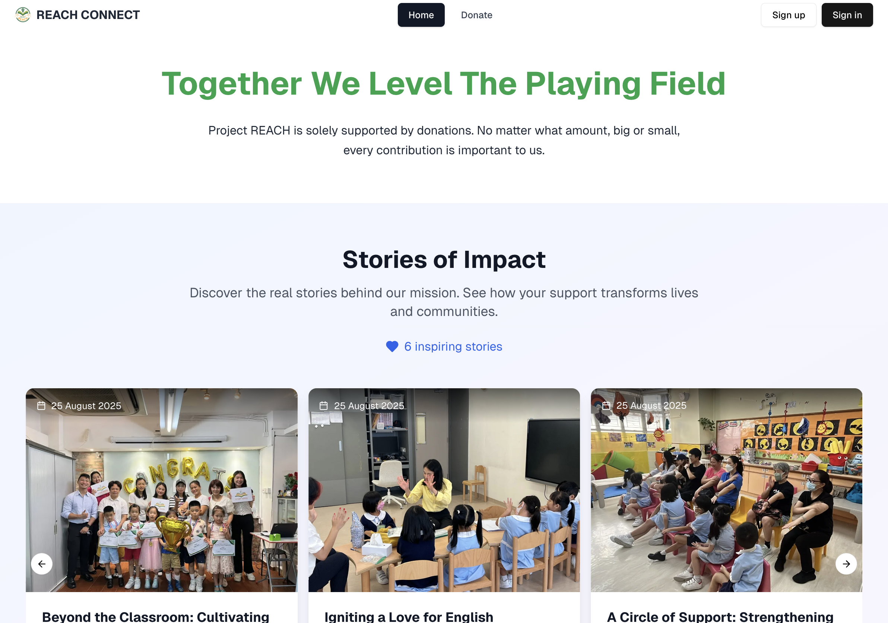

# Project REACH CONNECT - Donor Engagement Platform 💝

**Connecting hearts, transforming lives, one donation at a time.**

REACH CONNECT is a comprehensive donor engagement web application built for Project REACH Hong Kong, enabling transparent donation tracking, powerful impact visualization, and meaningful community connections through the power of technology.

## 🌟 Demo

**Live Demo:** [Project REACH Platform](https://reach-connect.vercel.app/)



*Experience the donation flow, impact dashboard, and AI-powered story generation in action*

## 🎯 Problem & Solution

**The Challenge:** Donors often feel disconnected from the impact of their contributions, leading to reduced engagement and one-time donations rather than sustained support. Meanwhile, nonprofits struggle with manual outreach and content creation.

**Our Solution:** Project REACH Platform bridges this gap by providing:
- **Transparent Impact Tracking**: Real-time visualization of donation progress across schools
- **Personal Stories**: Direct connection to students and schools benefiting from donations  
- **AI-Powered Automation**: Automated prospect research, content generation, and outreach campaigns
- **Gamified Engagement**: Achievement system and milestone tracking to encourage continued giving
- **Streamlined Operations**: Easy package management and school administration tools

Built for the **Morgan Stanley Code to Give Hackathon 2025** in partnership with **Project REACH Hong Kong**.

## 🚀 Quick Start

### Prerequisites
- Node.js 18+ 
- npm/yarn/pnpm
- Supabase account
- Stripe account (for payments)
- OpenAI API key (for AI features)

### Installation

1. **Clone the repository**
   ```bash
   git clone https://github.com/your-username/project-reach-platform
   cd project-reach-platform
   ```

2. **Install dependencies**
   ```bash
   npm install
   # or
   pnpm install
   ```

3. **Set up environment variables**
   ```bash
   cp .env.example .env.local
   ```
   Add your API keys to `.env.local`:
   ```
   NEXT_PUBLIC_SUPABASE_URL=your_supabase_url
   NEXT_PUBLIC_SUPABASE_ANON_KEY=your_supabase_anon_key
   STRIPE_SECRET_KEY=your_stripe_secret_key
   NEXT_PUBLIC_STRIPE_PUBLISHABLE_KEY=your_stripe_publishable_key
   OPENAI_API_KEY=your_openai_api_key
   MJ_APIKEY_PUBLIC=your_mailjet_public_key
   MJ_APIKEY_PRIVATE=your_mailjet_private_key
   GOOGLE_API_KEY=your_google_api_key
   GOOGLE_CX=your_google_custom_search_engine_id
   ```

4. **Run the development server**
   ```bash
   npm run dev
   ```

5. **Open [http://localhost:3000](http://localhost:3000)**

## 🛠️ Tech Stack

- **Frontend**: Next.js 15, React, TypeScript, Tailwind CSS
- **UI Components**: shadcn/ui, Radix UI primitives
- **Backend**: Supabase (PostgreSQL, Auth, Storage, Real-time)
- **Payments**: Stripe API integration with receipt automation
- **AI/ML**: OpenAI GPT-4 for content generation and prospect research
- **Email**: Mailjet for automated receipt delivery
- **Search**: Google Custom Search API for prospect discovery
- **Charts**: Recharts for impact visualization
- **Deployment**: Vercel with automatic CI/CD

## ✨ Key Features

### For Donors 🎁
- **Flexible Donation Packages**: From individual student support (HK$100/month) to full school sponsorship (HK$1,500,000)
- **Real-time Impact Dashboard**: Live charts showing funding progress and outcomes across schools
- **Achievement System**: Gamified badges for donation milestones and engagement levels
- **Personal Story Feed**: Curated stories from schools and students they've supported
- **Automated Receipts**: PDF receipt generation with proper tax deduction formatting
- **Heat Map Visualization**: Geographic view of donation impact across Hong Kong

### For Administrators (Project REACH) 🤖
- **AI Prospect Research**: Automated LinkedIn and company research with boolean query generation
- **Content Creation Suite**: AI-powered story generation in English and Traditional Chinese
- **Visual Content Designer**: Drag-and-drop poster, newsletter, and thank-you card creator
- **Smart Outreach**: Personalized email and InMail template generation
- **Package Management**: Easy creation and modification of donation tiers
- **School Administration**: Comprehensive database with funding tracking and projected needs
- **Analytics Dashboard**: Donor insights, engagement metrics, and funding forecasts

### Platform Core Features ⚡
- **Secure Authentication**: Role-based access control with Supabase Auth
- **Multi-Payment Support**: Stripe integration + Hong Kong bank transfer options
- **Mobile-First Design**: Responsive interface optimized for all devices
- **Multilingual Support**: English and Traditional Chinese content generation
- **Real-time Updates**: Live donation tracking and story notifications
- **PDF Generation**: Automated receipt creation with official charity formatting

## 🔧 Implementation Highlights

### Smart Badge System
Our achievement system uses efficient SQL aggregations to evaluate donation patterns in real-time,
ensuring you get the most up to date data without severe performance impact.

```typescript
// Real-time badge evaluation without performance impact
const newBadges = await recomputeAndPersistUserBadges(userId);
```

### AI-Powered Content Pipeline
- **Prospect Research**: Uses OpenAI to analyze public profiles on the web and generate targeted outreach
- **Story Generation**: Automated impact stories with anonymization options
- **Visual Content**: Template-based poster and newsletter creation with export capabilities

### Seamless Payment Integration
```typescript
// Secure payment processing with automated receipt delivery
const receiptRef = await generateAndEmailReceipt(donationId);
```

### Advanced Search & Targeting
- Google Custom Search integration for prospect discovery
- Boolean query generation for LinkedIn Sales Navigator
- Intelligent scoring system for prospect qualification

## 🎯 Challenges & Learnings

**Challenge**: Creating an AI system that could generate culturally appropriate content in Traditional Chinese while maintaining donor engagement best practices.

**Solution**: Implemented a sophisticated prompt engineering system with cultural context awareness and tone adjustment based on content type and audience.

**Key Learning**: The importance of building automation tools that empower nonprofits to scale independently. Our AI features reduce manual work by 80% while maintaining content quality and personalization.

## 🚀 Deployment

The application is deployed with enterprise-grade infrastructure:

- **Frontend**: Vercel with automatic deployments and preview environments
- **Database**: Supabase PostgreSQL with Row Level Security and real-time subscriptions
- **File Storage**: Supabase Storage for secure image and document handling
- **Monitoring**: Built-in error tracking and performance monitoring
- **Environment**: Production environment variables configured for security

## 🏆 Team

Built with ❤️ by Team 15 for Morgan Stanley Code to Give 2025:

- **Benedict** - Full-stack development, Code Quality, Database Management, UI/UX design
- **Weijie** - Data visualization, Heat maps, Analytics dashboard  
- **Yiming** - Payment processing, Receipt automation, Backend architecture
- **Sharon** - Story management, Content curation, User experience
- **Felicia** - User profiles, Donor journey optimization, Payment integration
- **Haoyu** - Admin tools, School management, Projected funding
- **Tricia** - AI integration, Outreach automation, Content generation


### Database Schema
Our Supabase schema includes optimized tables for:
- User management and authentication
- Donation tracking and receipt generation  
- Package and school administration
- Story content and metadata
- Badge achievement system

## 🔒 Security & Compliance

- **Data Protection**: Full GDPR compliance with user data anonymization
- **Payment Security**: PCI DSS compliant payment processing via Stripe
- **Authentication**: Secure session management with Supabase Auth
- **Content Safety**: AI content moderation and approval workflows

## 📈 Impact Metrics

- **Donation Process**: Reduced from 15+ minutes to under 3 minutes
- **Content Creation**: 80% reduction in manual story creation time
- **Prospect Research**: Automated research saves 2+ hours per prospect
- **Receipt Processing**: 100% automated with instant delivery

## 📄 License

This project was developed for the Morgan Stanley Code to Give Hackathon 2025 in partnership with Project REACH Hong Kong. 

## 🙏 Acknowledgments

Special thanks to:
- **Project REACH Hong Kong** for their partnership and insights
- **Morgan Stanley** for hosting Code to Give 2025
- **Mentors Praveen and Libo** for their invaluable guidance throughout this journey

---

*"Every donation creates a story worth sharing. Every story creates a connection worth nurturing."*  
**- Project REACH Platform Team**

## 🔗 Links

- [Live Demo](https://reach-connect.vercel.app/)
- [Project REACH Website](https://reach.org.hk)
